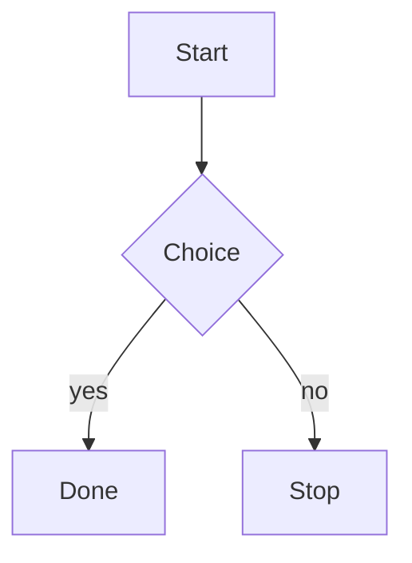

# dsh-mermaid-fence

English | [中文摘要](#中文摘要)

Renders ```mermaid fences in the dsh Web GUI chat as SVG diagrams.

A **settled** fence becomes a diagram. A fence that is still streaming does not —
it stays an ordinary code block until the turn settles, so a half-written diagram
never flickers, never re-parses on every chunk, and never reports a parse error
for text the model is still in the middle of writing.

> **Positioning, stated up front.** Two community plugins already do this, and
> both do more than this one: [`AKS1st/dsh-mermaid`](https://github.com/AKS1st/dsh-mermaid)
> and [`timedomain1/dsh-mermaid-renderer`](https://github.com/timedomain1/dsh-mermaid-renderer).
> If you want lazy viewport-driven loading, zoom, a fullscreen viewer, or an
> error-report loop, install one of those — see
> [How this differs](#how-this-differs-from-the-two-plugins-that-already-exist).
> This package exists for one thing they do not do: it **hardens mermaid's
> rendered SVG after mermaid runs**, removing the network-capable elements that
> `securityLevel: 'strict'` still lets through. Read that section before you
> install it; the hardening is real but partial, and the section says exactly
> how far it goes.

## 中文摘要

这是一个 dsh Web GUI 插件，把**已定格**的 ```mermaid 围栏渲染为 SVG 图；流式输出中的围栏保持为代码块。

**先说清楚定位**：社区里已经有更成熟的两个同类插件 —— `AKS1st/dsh-mermaid`（懒加载、视口驱动、全屏缩放、报错回环）和 `timedomain1/dsh-mermaid-renderer`（图/源码切换、缩放、独立查看器）。想要这些功能，请优先用它们。

本插件唯一多出来的一步：在 mermaid 渲染完成后**再加固一遍 SVG**，删掉 `securityLevel: 'strict'` 仍会保留的可联网标签（`img`/`iframe`/`object`/`embed`/`image`/`audio`/`video`/`source`/`track`）、剥离 `on*` 属性、丢弃非片段且非 `data:image` 的 `href`/`src`。**但这不能阻止 mermaid 自己在渲染阶段发起的那次请求**（已在 Chromium 实测），详见英文部分。

```

```

| Fence state | What you see |
| --- | --- |
| Settled, valid source | SVG diagram, plus a toggle that reveals the original source; the host's copy button stays reachable |
| Settled, invalid source | The original code block, plus a readable parse error |
| Still streaming | The original code block, untouched |
| `mermaid` declared on a non-diagram | The original code block (mermaid rejects it; the error is shown) |

This plugin is a **community package, not an upstream change**. DeepSeek Harness
does not accept external pull requests; its `CONTRIBUTING.md` points at the
`dsh-plugin` GitHub topic as the way to publish, which is how this package is
distributed. Nothing in this repository hooks an internal renderer seam — it
rewrites the rendered conversation DOM, which is what makes it installable as a
standalone plugin (and also its main fragility, see
[Known limitations](#known-limitations)).

## Install

Not on npm. The public registry returns 404 for `dsh-mermaid-fence`, so install
from git. Verified: this command installs the package and unpacks exactly the six
files below, with no build step (`client.js` is committed):

```sh
npm install github:XiaoBinGan/dsh-mermaid-fence
```

In a dsh profile the same specifier goes through the host's own installer, which
adds the bundle to the profile's layer list:

```sh
dsh plugin --profile web add github:XiaoBinGan/dsh-mermaid-fence
```

(The `dsh plugin` form is the documented route for git-installed bundles; it was
**not** executed on the machine where the numbers in this README were measured,
because the `dsh` CLI is not installed there. The `npm install` form was executed,
and its result is the six-file tree quoted below.)

The installed tree is exactly:

```
LICENSE  README.md  client.js  cordis.patch.yml  index.js  package.json
```

`client.js` is the prebuilt browser artifact — installing runs no build step.
`package.json` declares `dsh.bundle.patch: ./cordis.patch.yml`, which inserts the
package into the host's bundle when the profile lists it:

```yaml
- insert:
    - id: dsh-mermaid-fence
      name: 'dsh-mermaid-fence'
```

## Behaviour

### Settled-only

The host's `AssistantMarkdown` puts `data-streaming` on a message root while
tokens are arriving and drops the attribute once the turn settles. The plugin
scans only fences with no `[data-streaming]` ancestor. Nothing is parsed
speculatively, and a streaming fence is left byte-identical to what the host
rendered.

### Security is strict, and not configurable

`securityLevel: 'strict'` is hardcoded in `src/render.js`. It is **not** an
option and cannot be relaxed through configuration, because fence content is
model output — untrusted input. There is no `securityLevel` key, no `htmlLabels`
switch and no palette in the public surface: `themeVariables` is derived inside
the renderer from the host's own CSS tokens, and the renderer's only exported
methods are `render` and `refreshTheme`.

### What hardening removes, and what it does not — measured

`securityLevel: 'strict'` is necessary but not sufficient, so the SVG is passed
through `src/harden.js` after mermaid returns it. That pass removes the
`script`, `iframe`, `object`, `embed`, `img`, `image`, `audio`, `video`,
`source` and `track` elements, strips every `on*` attribute, and drops any
`href`/`xlink:href`/`src`/`srcset`/`data`/`poster`/`action`/`formaction` value
that is not a same-document fragment (`#id`) or a `data:image/` URI.

Measured in real Chromium against mermaid 11.17.2 (all of these numbers are from
the runs recorded under [Verification performed](#verification-performed)):

| Measured | Result |
| --- | --- |
| mermaid's SVG for the label ``, under `strict` | `` — handler stripped, element **and its URL kept** |
| the same with the plugin's own config (`flowchart.htmlLabels: false`) | unchanged: the `` still survives mermaid |
| after `harden.js` | no `img`/`image` element left; the diagram's `rect`/`path`/`text` primitives survive |
| a `click C "https://example.com/tip"` directive under `strict` | mermaid emits `<a xlink:href="https://example.com/tip">` (no `href`); hardening drops that attribute and leaves the anchor inert |

**The limit, stated plainly.** Hardening runs *after* `mermaid.render()`
resolves, and mermaid builds its output by inserting the markup into the live
document. In Chromium, a label of `` therefore produces a
real off-origin request **during the render call, before `harden.js` ever sees
the string** — measured as one request during render plus one on the insert of
mermaid's raw markup, versus two during render and none on insert for the
hardened path. So this pass removes the elements from what stays in the page
(no live `` element survives in the DOM, and a re-render of the same
markup cannot re-fetch), but it does **not** stop mermaid's own transient fetch.
The only thing that stops that is refusing to render untrusted labels in the
first place; `securityLevel: 'strict'` with `htmlLabels: false` does not.

### Failure is visible, never blank

If mermaid rejects the source, the plugin keeps the host's code block exactly as
it was and appends a `role="status"` notice naming mermaid's own error. The
source is never lost and no exception escapes into the host's console. A failed
fence is marked so a later scan does not retry it.

### Theme binding

Colors come from the host's own `--dsw-*` custom properties (read off `<body>`
via `getComputedStyle`), so a diagram is legible in both themes without the
plugin owning a palette. Dark mode is detected through the host's
`data-ds-dark-theme` attribute on `<body>`. When that attribute flips, the
plugin re-reads the tokens and re-renders the mounted diagrams in the subtree
that changed.

### Source access

Each diagram keeps the host's banner — so the host's own copy button stays
reachable — and adds a toggle that reveals the original fence text.

## Disposal

Everything the plugin creates is registered with `ctx.effect` inside `apply`, and
each registration returns its own cleanup: the `MutationObserver` (disconnected),
the debounce timer (cleared), the arm (disposed, dropping all references) and the
injected `<style>` (removed). Disposal is verified by a test that mounts a new
fence *after* running the cleanups and asserts it is not rendered.

## Known limitations

- **Bundle size.** `client.js` is 3,461,602 bytes (3.3 MiB / 3.5 MB decimal;
  962,140 bytes gzipped) because mermaid is inlined. See
  [Why mermaid is inlined](#why-mermaid-is-inlined).
- **DOM post-processing, not a renderer arm.** The plugin rewrites the rendered
  conversation DOM rather than hooking the host's `renderCode()` seam. This is
  what makes it installable as a standalone community plugin, but it means the
  diagram is inserted after React has rendered, and a future host change to the
  code-block DOM (the `.md-code-block`, `[data-code-block-banner]` and
  `[data-code-block-content]` contract) would need this plugin updated.
- **Language detection reads the banner text.** The host leaves
  `code.className` empty and puts the fence language only in the banner's
  infostring, so that is what the plugin reads, with a first-keyword fallback for
  undeclared fences. An undeclared fence whose first keyword is not in the
  recognised set is not rendered.
- **jsdom cannot lay out SVG.** The unit tests stub `getBBox`, `getScreenCTM`
  and `getComputedTextLength`, so they prove the render pipeline runs and
  produces the expected structure — they do **not** prove geometry. Geometry and
  sanitization are verified in real Chromium (see below).
- **One diagram per fence, no interactivity.** Click handlers and scripted
  diagrams are disabled by design (`securityLevel: 'strict'`).

## How this differs from the two plugins that already exist

Both are MIT-licensed and both do more rendering work than this package. If
either of them fits you, use it.

| | `AKS1st/dsh-mermaid` | `timedomain1/dsh-mermaid-renderer` | this package |
| --- | --- | --- | --- |
| mermaid loading | lazily, from the host's own route | lazy fetch on first diagram | inlined in `client.js` (3.5 MB) |
| When it renders | viewport-driven, queued one at a time | on scan | on settle |
| Zoom / fullscreen | fullscreen overlay, wheel zoom, drag-pan | card zoom 0.25–4x, standalone viewer, open in new tab | **none** |
| Source view | banner copy button | diagram/source toggle + copy | source toggle, host copy button kept |
| Render-failure UX | error bar with copy-report and "send to AI" | retry hint | one-line notice naming mermaid's error |
| Language coverage | infostring `mermaid` | `mermaid` / `mmd`, plus keyword detection | infostring `mermaid`/`mmd`, plus keyword detection |
| After mermaid returns | inserts mermaid's SVG | inserts mermaid's SVG | **hardens the SVG first** (see above, including the limit) |

So: prefer `AKS1st/dsh-mermaid` if you want a polished, lazily-loaded viewer
with an error-report loop; prefer `timedomain1/dsh-mermaid-renderer` if you want
per-card zoom and a standalone viewer. Install this one only if the post-render
hardening pass is the thing you are after — and read
[the limit](#what-hardening-removes-and-what-it-does-not--measured) first, because
it does not close the fetch that mermaid itself performs during rendering.

## Why mermaid is inlined

The host's module table resolves a `dsh.client` row to the package's `./client`
export. mermaid is not a platform module, so it cannot come from `require(...)`.

The loader *does* support package-local dynamic chunks through `require.async`,
and `src/browser-entry.js` uses a dynamic `import('mermaid')` — but esbuild's
`iife` format has no code splitting, so that import becomes a lazily-*evaluated*
chunk inside the single output file rather than a separate file. A separate
chunk URL is composed by the host's bundle roster, and a standalone community
plugin has no roster row, so a genuinely split build would not resolve at
install time.

Inlining is therefore the only mechanism that installs with no host-side
integration — and it is this package's main practical cost. The dynamic import
is kept because it still defers mermaid's module body — and its ~3 MB of diagram
definitions — until the plugin applies.

## Verification performed

Every command below was run in this package directory on the machine that
produced this README. Counts and sizes are copied from the real output of those
runs, not estimated. Environment: Node v24.7.0, npm 11.5.1, mermaid 11.17.2
(`node_modules/mermaid/package.json`), Playwright's Chromium.

| Command | Result |
| --- | --- |
| `npm test` | 26 tests, 25 pass, 0 fail, 1 skipped |
| `npm run test:browser` (real Chromium) | 2 pass |
| `npm run check` (`node --check client.js && node --check index.js`) | exit 0 |
| `wc -c client.js` | 3,461,602 bytes |
| `gzip -c client.js \| wc -c` | 962,140 bytes |
| `npm pack --dry-run` | 6 files, 967.8 kB packed / 3.5 MB unpacked (the tarball includes this README, so the packed figure moves by well under a kilobyte whenever the README is edited) |
| `npm install github:XiaoBinGan/dsh-mermaid-fence` (clean dir) | exit 0, 1 package, the six files above, `client.js` byte-identical (sha256 match) |

The skipped test is `a label containing HTML is escaped rather than executed`:
mermaid's HTML-label sanitizer never settles under jsdom (no layout, no real
HTML parser completion), so the assertion was moved to the real-browser suite
rather than being faked with a stub.

Verified in real Chromium (`tests/browser.test.mjs`, driving
`example/harness.html` over HTTP). The harness reports its own measurements, so
these are the actual numbers from a run, not just pass/fail:

- a settled fence produces an SVG with a **non-zero layout box** (250 × 335 in
  the harness), 4 node groups, 3 edges and an edge path with real
  `getTotalLength()` geometry (46);
- a streaming fence produces **zero** diagrams;
- an invalid fence produces zero diagrams and one error notice, quoting
  mermaid's own message (`No diagram type detected matching given configuration…`);
- the host's `--dsw-*` token was read and the diagram's text color resolved to a
  real value (`rgb(27, 28, 31)`);
- the host's copy button is still reachable and the source toggle works;
- no uncaught page error in any case;
- a hostile label (``) yields no `<script>`, no
  `` and no `on*=` attribute, and raises no dialog.

The hardening limit documented above was measured separately, with a throwaway
Chromium script (two servers: the page origin and an "attacker" origin that
counts hits). Under mermaid 11.17.2 with the plugin's exact config, a label
`/x.gif">` produced: raw path — 1 off-origin request
during `mermaid.render()`, 1 on inserting mermaid's SVG, 1 more on inserting it
again, 2 `` elements left in the DOM; hardened path — 2 during render, 0 on
either insert, 0 `` elements left. The transient render-time fetch is
mermaid's, not this plugin's, and this plugin cannot prevent it.

## Open the harness yourself

```sh
npx serve .        # or any static server
open http://localhost:3000/example/harness.html
```

The harness mounts the real `client.js` against a hand-written fence DOM (one
settled, one streaming, one invalid, one hostile) and has a theme toggle to check
light and dark.

## Development

```sh
npm install
npm run build     # regenerate client.js with esbuild
npm test          # jsdom suite
npm run test:browser   # real Chromium (needs: npx playwright install chromium)
```

## Layout

```
client.js          built browser artifact (committed; mermaid inlined)
index.js           Host face (no services, no listeners)
cordis.patch.yml   bundle insert
src/
  browser-entry.js entry point of the built artifact
  client.js        the Cordis surface: apply, effects, observer
  arm.js           the DOM walk: settled gate, mount, fallback, dispose
  render.js        the renderer; hardcoded strict security
  detect.js        language/source recognition
  theme.js         host token → mermaid themeVariables
  harden.js        post-render SVG hardening (removes fetch/execute vectors)
  styles.js        token-driven stylesheet
  i18n.js          UI strings
example/harness.html  browser harness
tests/             node:test suites over real DOM and real mermaid
```

## License

MIT
