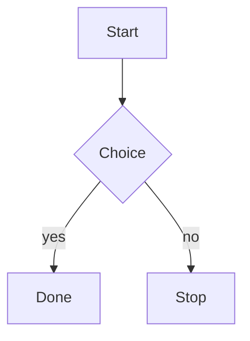

# dsh-mermaid-fence

Renders ```mermaid fences in the dsh Web GUI chat as SVG diagrams.

A **settled** fence becomes a diagram. A fence that is still streaming does not —
it stays an ordinary code block until the turn settles, so a half-written diagram
never flickers, never re-parses on every chunk, and never reports a parse error
for text the model is still in the middle of writing. That settled-only rule is
what the most-upvoted upstream request (Discussion #6502) asks for.

```

```

| Fence state | What you see |
| --- | --- |
| Settled, valid source | SVG diagram, with a control to reveal/copy the source |
| Settled, invalid source | The original code block, plus a readable parse error |
| Still streaming | The original code block, untouched |
| `mermaid` declared on a non-diagram | The original code block (mermaid rejects it; the error is shown) |

## Install

```sh
npm install dsh-mermaid-fence
```

The built `client.js` is committed, so installing runs no build step. The
`dsh.bundle.patch` entry in `package.json` points at `cordis.patch.yml`, which
inserts the package into the host's bundle:

```yaml
- insert:
    - id: dsh-mermaid-fence
      name: 'dsh-mermaid-fence'
```

## Behaviour

### Settled-only

The host's `AssistantMarkdown` puts `data-streaming` on a message root while
tokens are arriving and drops the attribute once the turn settles. The plugin
scans only fences with no `[data-streaming]` ancestor. Nothing is parsed
speculatively, and a streaming fence is left byte-identical to what the host
rendered.

### Security is strict, and not configurable

`securityLevel: 'strict'` is hardcoded in `src/render.js`. It is **not** an
option and cannot be relaxed through configuration, because fence content is
model output — untrusted input. There is no `themeVariables` override, no
`htmlLabels`, and no `securityLevel` key in the public surface; the renderer's
only exported methods are `render` and `refreshTheme`.

### Failure is visible, never blank

If mermaid rejects the source, the plugin keeps the host's code block exactly as
it was and appends a `role="status"` notice naming mermaid's own error. The
source is never lost and no exception escapes into the host's console. A failed
fence is marked so a later scan does not retry it.

### Theme binding

Colors come from the host's own `--dsw-*` custom properties (read off `<body>`
via `getComputedStyle`), so a diagram is legible in both themes without the
plugin owning a palette. Dark mode is detected through the host's
`data-ds-dark-theme` attribute on `<body>`; on a theme switch the plugin re-reads
the tokens and re-renders mounted diagrams.

### Source access

Each diagram keeps the host's banner — so the host's own copy button stays
reachable — and adds a toggle that reveals the original fence text.

## Disposal

Everything the plugin creates is registered with `ctx.effect` inside `apply`, and
each registration returns its own cleanup: the `MutationObserver` (disconnected),
the debounce timer (cleared), the arm (disposed, dropping all references) and the
injected `<style>` (removed). Disposal is verified by a test that mounts a new
fence *after* running the cleanups and asserts it is not rendered.

## Known limitations

- **Bundle size.** `client.js` is ~3.4 MB (~940 kB gzipped) because mermaid is
  inlined. See [Why mermaid is inlined](#why-mermaid-is-inlined).
- **DOM post-processing, not a renderer arm.** The plugin rewrites the rendered
  conversation DOM rather than hooking the host's `renderCode()` seam. This is
  what makes it installable as a standalone community plugin, but it means the
  diagram is inserted after React has rendered, and a future host change to the
  code-block DOM (the `.md-code-block`, `[data-code-block-banner]` and
  `[data-code-block-content]` contract) would need this plugin updated.
- **Language detection reads the banner text.** The host leaves
  `code.className` empty and puts the fence language only in the banner's
  infostring, so that is what the plugin reads, with a first-keyword fallback for
  undeclared fences. An undeclared fence whose first keyword is not in the
  recognised set is not rendered.
- **jsdom cannot lay out SVG.** The unit tests stub `getBBox`, `getScreenCTM`
  and `getComputedTextLength`, so they prove the render pipeline runs and
  produces the expected structure — they do **not** prove geometry. Geometry and
  sanitization are verified in real Chromium (see below).
- **One diagram per fence, no interactivity.** Click handlers and scripted
  diagrams are disabled by design (`securityLevel: 'strict'`).

## Why mermaid is inlined

The host's module table resolves a `dsh.client` row to the package's `./client`
export. mermaid is not a platform module, so it cannot come from `require(...)`.

The loader *does* support package-local dynamic chunks through `require.async`,
and `src/browser-entry.js` uses a dynamic `import('mermaid')` — but esbuild's
`iife` format has no code splitting, so that import becomes a lazily-*evaluated*
chunk inside the single output file rather than a separate file. A separate
chunk URL is composed by the host's bundle roster, and a standalone community
plugin has no roster row, so a genuinely split build would not resolve at
install time.

Inlining is therefore the only mechanism that installs with no host-side
integration. The published community plugin `dsh-mermaid` makes the same trade
(3.5 MB unpacked). The dynamic import is kept because it still defers mermaid's
module body — and its ~3 MB of diagram definitions — until the plugin applies.

## Verification performed

All commands were run in this package directory. Counts are from the real
output of those runs; see `npm test` and `npm run test:browser`.

| Command | Result |
| --- | --- |
| `npm test` | 26 tests, 25 pass, 0 fail, 1 skipped |
| `npm run test:browser` (real Chromium) | 2 pass |
| `npm run check` (`node --check client.js && node --check index.js`) | exit 0 |
| `npm pack --dry-run` | 6 files, 964.2 kB packed / 3.5 MB unpacked |

The skipped test is `a label containing HTML is escaped rather than executed`:
mermaid's HTML-label sanitizer never settles under jsdom (no layout, no real
HTML parser completion), so the assertion was moved to the real-browser suite
rather than being faked with a stub.

Verified in real Chromium (`tests/browser.test.mjs`, driving
`example/harness.html` over HTTP):

- a settled fence produces an SVG with a **non-zero layout box**, 4 node groups,
  3 edges and an edge path with real `getTotalLength()` geometry;
- a streaming fence produces **zero** diagrams;
- an invalid fence produces zero diagrams and one error notice;
- a hostile label (``) yields no `<script>`, no
  `` and no `on*=` attribute, and raises no dialog;
- the host's copy button is still reachable and the source toggle works;
- no uncaught page error in any case.

## Open the harness yourself

```sh
npx serve .        # or any static server
open http://localhost:3000/example/harness.html
```

The harness mounts the real `client.js` against a hand-written fence DOM (one
settled, one streaming, one invalid, one hostile) and has a theme toggle to check
light and dark.

## Development

```sh
npm install
npm run build     # regenerate client.js with esbuild
npm test          # jsdom suite
npm run test:browser   # real Chromium (needs: npx playwright install chromium)
```

## Layout

```
client.js          built browser artifact (committed; mermaid inlined)
index.js           Host face (no services, no listeners)
cordis.patch.yml   bundle insert
src/
  browser-entry.js entry point of the built artifact
  client.js        the Cordis surface: apply, effects, observer
  arm.js           the DOM walk: settled gate, mount, fallback, dispose
  render.js        the renderer; hardcoded strict security
  detect.js        language/source recognition
  theme.js         host token → mermaid themeVariables
  styles.js        token-driven stylesheet
  i18n.js          UI strings
example/harness.html  browser harness
tests/             node:test suites over real DOM and real mermaid
```

## License

MIT
